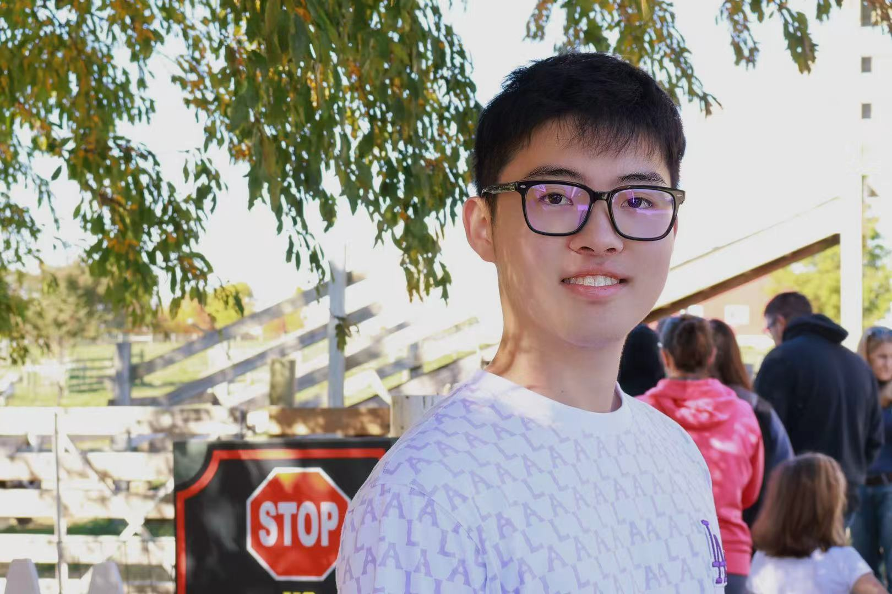

# LLM-Powered Quant Developer Assistant

## 🧠 Project Overview

This project is a fully autonomous AI-powered Quant Developer Assistant. It
enables users—such as retail investors, quant researchers, and finance
students—to generate, execute, and evaluate algorithmic trading strategies by
simply asking natural language questions.

> Example:
> **"What's a good momentum strategy for TSLA over the past 3 months?"**

The system returns a step-by-step strategy plan, generates code, executes it,
performs backtests on historical data, and outputs a full evaluation summary.

---

## 🚀 Key Features

### ✅ GPT-Orchestrated Strategy Planning
- LLM generates a JSON plan detailing asset, indicators, timeframe, evaluation
- metrics, and task sequence

### ✅ Code Generation & Automated Execution
- Each step is translated into Python code and auto-executed
- Failures trigger a threaded auto-fix system with up to 3 retries

### ✅ Strategy Evaluation & Backtesting
- Historical stock data is used for realistic backtesting
- Calculates Sharpe Ratio, Max Drawdown, Annualized Return, Win Rate, and more

---

## 🧱 Technology Stack

- **LLMs**: OpenAI GPT-4o, DeepSeek-Chat, Gemini Pro
- **Backend**: Python, Pandas
- **Execution Engine**: `exec()` with error recovery + retry logic
- **Data**: Yahoo Finance API
- **Frontend (optional)**: Flask

---

## 📂 Project Structure
```
src/
├── logger.py               # format logging
├── main.py                 # CLI entrypoint: generate → execute → compare
├── step_generator.py       # Uses LLM to generate strategy plans
├── step_executor.py        # Executes and evaluates each step
├── autofix.py              # Threaded error handler + code fixer
├── utils.py                # utility functions
├── config_data/
│   └── rule.py             # Contains common error rules for LLM prompting
strategy/                   # Saved strategy
summaries/                  # Final results for each strategy

```
## 🚀 How to Run

### Create virtual environment

```
python3 -m venv hft
```

### Install dependencies

``` 
pip install -r requirements.txt 
```

### Generate + Execute Strategy Plan

``` python
python3 src/main.py -m <llm> -p <prompt> -f <file_path> 
```

- `<llm>` - LLM to use (e.g. GPT-4o, Gemini, Deepseek, etc)
- `<prompt>` - prompt to generate a strategy plan for
- `<file_path>` - generated strategy plan file path

Example command line inputs.
```
python3 main.py -m gpt-4o -p What's a good strategy for NVDA in the next 30 days?
```

```
python3 main.py -m gpt-4o -f strategy/strategy_gpt-4o_What's_a_good_strategy_for_NVDA_in_the_next_30_days_20250425_172847.json
```

## 👥 Team Members

**Hanxi Fang**

Email: hanxif2@illinois.edu

LinkedIn:

**Hanqi Mao**

<br/>

Email: hanqim2@illinois.edu

LinkedIn: https://www.linkedin.com/in/hanqi-mao-a1251b2bb/

Hanqi Mao is an undergraduate student in Computer Science at the University of Illinois Urbana-Champaign (UIUC), with a strong academic background and research experience in machine learning and system programming. His work focuses on building practical and efficient AI systems, particularly in large language models (LLMs), computer vision, and real-time applications. He has contributed to projects involving medical image generation using diffusion models, LLM-integrated weather applications, and bias mitigation in text-to-image systems. Passionate about interdisciplinary innovation, Hanqi is exploring applications of LLM agents in domains such as recommendation systems, automated decision-making, and user-interactive platforms.

**Dadong Peng**

Email: dadongp2@illinois.edu

LinkedIn: https://www.linkedin.com/in/dadong-peng-50618619b/

I'm Dadong Peng, PhD candidate in Mathematics, graph theory. With multiple years experience in gto poker, machine learning, data management, R & python programming, database and optimization. I had internship at Aviatrix in 2023 and received full-time sde offer from Huawei in 2024. now I turned my interest in trading cash equities and cryptocurrencies, especially in building LLM-based auto trading system.

**Hongbo Zheng**

Email: hongboz2@illinois.edu

LinkedIn: https://www.linkedin.com/in/hongbo-zheng-b088581b6/

Hongbo Zheng is a master’s student in Computer Science at the University of
Illinois Urbana-Champaign (UIUC). With a background in electrical engineering
and computer science, his interests lie in designing efficient machine learning
algorithms for vision and language models, with applications spanning domains
such as healthcare and autonomous systems. He is particularly passionate about
developing robust large language model (LLM) agents for diverse real-world
applications, including high-frequency trading, automated reasoning, and
decision-making systems.